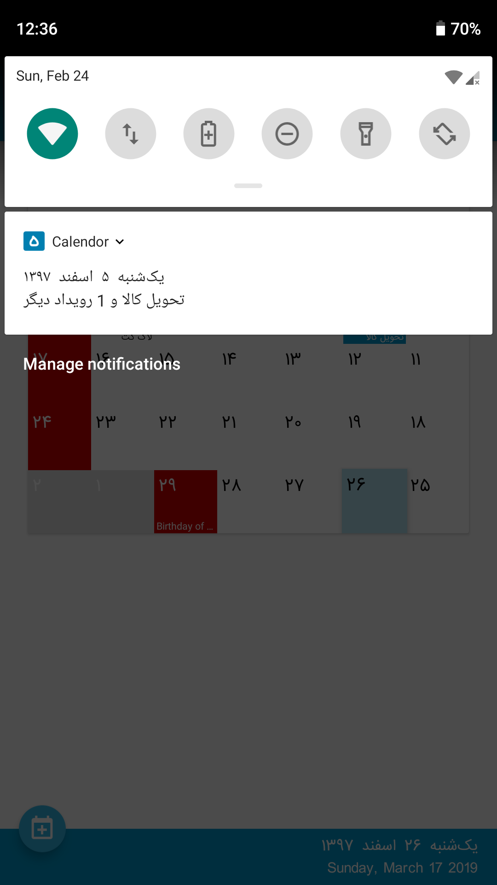

# Calendor 1.0
*Design and inspiration.*

   

Calendor is a simple material calendar designed with funtionality and easy of use in mind. 
All national and religious holidays are marked accurately for the current year, and will be updated for the following years.
**[Install on Google Play](https://play.google.com/store/apps/details?id=com.esbati.keivan.persiancalendar)**

### Features


* Events and holidays accurately marked 
* Add events to device calendar
* Sticky notification on your preference

### Goals
* Rewriting to Kotlin, while applying clean architecture principles
* Modularize the app using [dynamic feature](https://developer.android.com/guide/app-bundle/)
* Improve extensibility of the architecture to add other calendars like Georgian or Hijri

### Contributing
Your contributions are always welcomed, Where and how are coming soon! 
Comments and issues are welcomed too ^^

### License


```
Copyright (C) 2019 Keivan Esbati
This program is free software: you can redistribute it and/or modify it under the terms of the GNU General Public License as published by the Free Software Foundation, version 3.

This program is distributed in the hope that it will be useful, but WITHOUT ANY WARRANTY; without even the implied warranty of MERCHANTABILITY or FITNESS FOR A PARTICULAR PURPOSE. See the GNU General Public License for more details.

You should have received a copy of the GNU General Public License along with this program. If not, see <https://www.gnu.org/licenses/>.
```