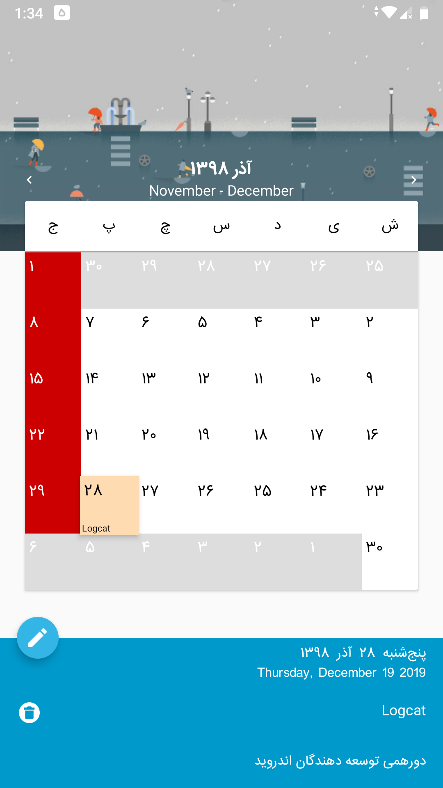
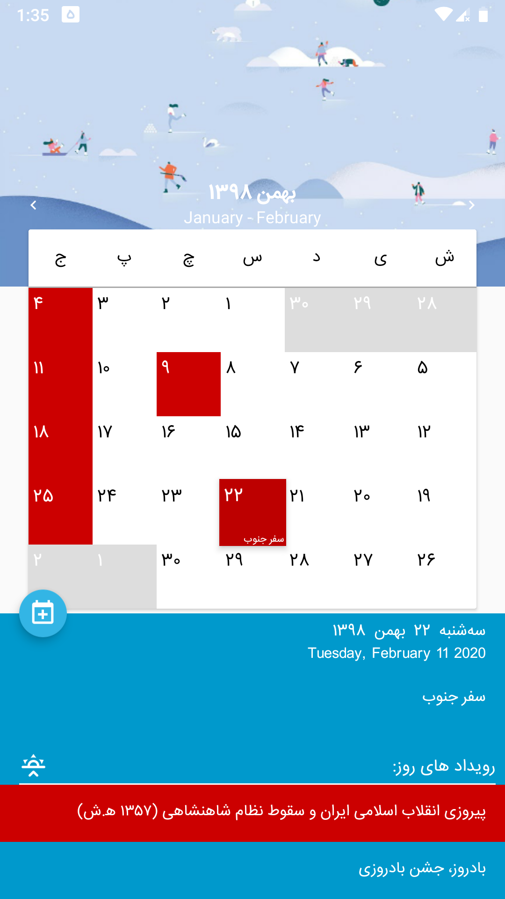
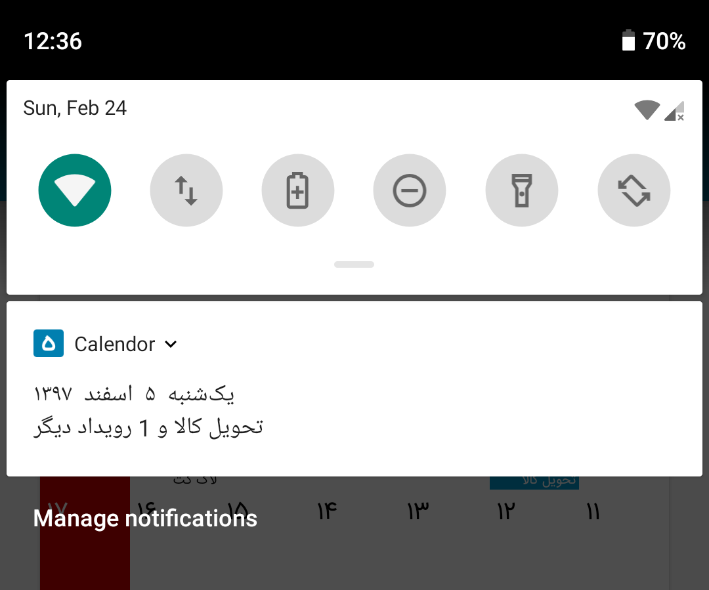

[](https://travis-ci.com/Tenkei/Calendor) [](https://GitHub.com/Tenkei/Calendor/releases/) [](https://github.com/Tenkei/Calendor/blob/master/LICENSE)

# Calendor 1.0
*Design and inspiration.*

   

Calendor is a simple material calendar designed with functionality and ease of use in mind.
All national and religious holidays are marked accurately for the current year, and will be updated for the following years.
**[Install on Google Play](https://play.google.com/store/apps/details?id=com.github.tenkei.calendor)**



### Features
* Events and holidays accurately marked 
* Add events to device calendar
* Sticky notification on your preference

### Goals
* Rewriting to Kotlin, while applying the Clean architecture principles
* Applying SOLID principles to achieve a testable code
* Improve extensibility of the architecture to add other calendar systems like Gregorian and Hijri


### Showcases
* Running **[Service](app/src/main/java/com/esbati/keivan/persiancalendar/features/notification "Service")** in background using sticky notification
* Creating **[View](app/src/main/java/com/esbati/keivan/persiancalendar/features/settings/ "View")** using design language systems and Kotlin DSL
* Implementating lightweight **[Service Locator](app/src/main/java/com/esbati/keivan/persiancalendar/components/ServiceLocator.kt "Service Locator")** with dynamic configuration and accesors  

### Contributing
Your contributions are always welcomed but for easier and faster code review please consider:
- Feature branches are created from **develop**
- When a feature is complete it is merged into the **develop**
- Create a descriptively named branch
- Every **branch** should only fix **one** issue, this way branches can be merged easier
- Each **commit** should only change **one** thing, this way commits can be reverted easier
- When you need feedback or help, or you think the branch is ready for merging, open a **pull request**
- Refrrain from adding tools and technologies that **increase** the **complexity** of the project

### License

```
Copyright (C) 2019 Keivan Esbati
This program is free software: you can redistribute it and/or modify it under the terms of the GNU General Public License as published by the Free Software Foundation, version 3.

This program is distributed in the hope that it will be useful, but WITHOUT ANY WARRANTY; without even the implied warranty of MERCHANTABILITY or FITNESS FOR A PARTICULAR PURPOSE. See the GNU General Public License for more details.

You should have received a copy of the GNU General Public License along with this program. If not, see <https://www.gnu.org/licenses/>.
```